# 🗺️ Rutas de Navegación - BeEnergy

## 📱 Información General del Proyecto

**Tipo de Proyecto:** Aplicación Móvil Flutter
**Plataformas:** Android / iOS
**SDK Flutter:** >=2.19.4 <3.0.0
**Arquitectura de Navegación:** Rutas Nombradas + Bottom Navigation Bar
**Persistencia de Sesión:** SQLite Database (`beEnergy.db`)
**Autenticación:** JWT Token + Base de Datos Local

---

## 🏗️ Arquitectura de Navegación

### Punto de Entrada
- **Widget:** `Beenergy` (Splash Screen)
- **Archivo:** [lib/screens/main_screen.dart](../../lib/screens/main_screen.dart)
- **Función:** Verifica estado de autenticación mediante SQLite

### Sistema de Rutas
- **Definición:** [lib/main.dart](../../lib/main.dart) - MaterialApp.routes
- **Total de Rutas Nombradas:** 20+
- **Navegación Principal:** NavPages con Bottom Navigation (5 pantallas)
- **Protección:** Verificación de sesión en punto de entrada

---

## 🔄 Flujo Principal de Navegación

### 1️⃣ Inicio de Aplicación

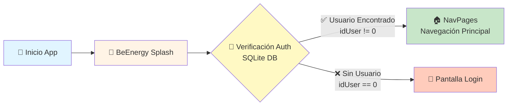

**Descripción del Flujo:**
1. Usuario abre la aplicación
2. Se muestra splash screen `Beenergy`
3. Se ejecuta `BlocBeenergy.getUserFromDB()`
4. **Decisión:**
   - Si existe usuario en SQLite → Redirige a `NavPages` (estado autenticado)
   - Si NO existe usuario → Redirige a `LoginScreen` (estado no autenticado)

---

## 🔓 Flujos No Autenticados (Rutas Públicas)

### 2️⃣ Flujo de Autenticación Completo

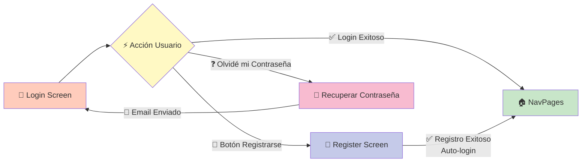

### 📋 Detalles de Pantallas Públicas

#### 🔑 Login Screen
- **Ruta:** `'login'`
- **Widget:** `LoginScreen()`
- **Archivo:** [lib/screens/main_screens/Login/login_screen.dart](../../lib/screens/main_screens/Login/login_screen.dart)
- **Funcionalidad:**
  - Autenticación con Email + Contraseña
  - Integración con API: `/auth/log-in`
  - Almacenamiento de JWT Token
  - Creación de sesión local en SQLite
- **Navegaciones posibles:**
  - ✅ Login exitoso → `NavPages`
  - 📝 "Registrarse" → `RegisterScreen`
  - ❓ "¿Olvidaste tu contraseña?" → `NoRecuerdomiclaveScreen`

#### 👤 Register Screen
- **Ruta:** `'register'`
- **Widget:** `RegisterScreen()`
- **Archivo:** [lib/screens/main_screens/Login/register_screen.dart](../../lib/screens/main_screens/Login/register_screen.dart)
- **Funcionalidad:**
  - Campos: Nombre, Email, Contraseña
  - Integración con API: `/auth/sign-up`
  - Auto-login después de registro exitoso
- **Navegación:**
  - ✅ Registro exitoso → Login automático → `NavPages`
  - ⬅️ Volver → `LoginScreen`

#### 🔄 Recuperar Contraseña
- **Ruta:** `'RecuerdoMiClave'`
- **Widget:** `NoRecuerdomiclaveScreen()`
- **Archivo:** [lib/screens/main_screens/Login/noRecuerdomiClave_screen.dart](../../lib/screens/main_screens/Login/noRecuerdomiClave_screen.dart)
- **Funcionalidad:**
  - Recuperación por email
  - Integración con API: `/auth/forgot-password`
- **Navegación:**
  - 📧 Email enviado → Volver a `LoginScreen`

---

## 🔐 Flujos Autenticados (Rutas Protegidas)

### 3️⃣ Navegación Principal - Bottom Navigation Bar

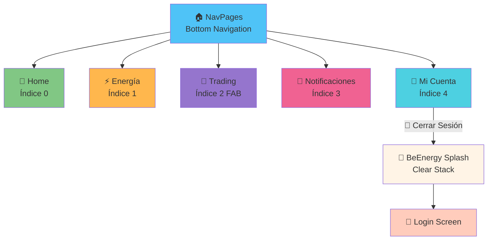

### 📱 Estructura del Bottom Navigation

**Widget:** `NavPages`
**Archivo:** [lib/views/navigation.dart](../../lib/views/navigation.dart)
**Tipo:** StatefulWidget con PageStorage

| Índice | Icono | Pantalla | Widget | Tipo Botón |
|--------|-------|----------|--------|------------|
| 0 | 🏡 Home | HomeScreen | `HomeScreen()` | Bottom Nav |
| 1 | ⚡ Energy | EnergyScreen | `EnergyScreen()` | Bottom Nav |
| 2 | 💱 Trading | TradingScreen | `TradingScreen()` | FAB (Centro) |
| 3 | 🔔 Alerts | NotificacionesScreen | `NotificacionesScreen()` | Bottom Nav |
| 4 | 👤 Profile | MicuentaScreen | `MicuentaScreen()` | Bottom Nav |

**Características:**
- **BottomAppBar** con `CircularNotchedRectangle`
- **FloatingActionButton** central para Trading
- **PageStorage** para preservar posiciones de scroll
- 4 botones visibles + 1 FAB = 5 pantallas totales

---

## 🏡 Sub-Navegaciones desde Home

### 4️⃣ Flujos desde Home Screen

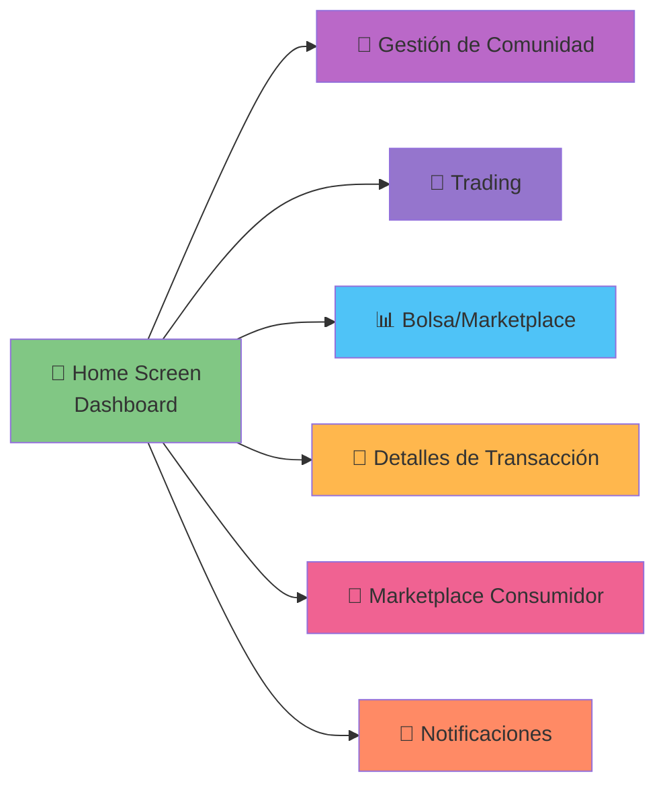

### 📊 Home Screen - Características

**Archivo:** [lib/screens/main_screens/home/home_screen.dart](../../lib/screens/main_screens/home/home_screen.dart)

**Funcionalidades:**
- 📈 Dashboard de consumo energético
- 📅 Selector de período (datos históricos)
- 👔 Toggle vista Admin/Usuario
- 📊 Visualización de estadísticas (CircularChart)
- 📋 Lista de transacciones recientes
- ⚡ Botones de acción rápida

**Navegaciones disponibles desde Home:**
1. `TransactionDetailScreen` - Detalles de transacciones
2. `CommunityManagementScreen` - Gestión de comunidad
3. `TradingScreen` - Trading de energía
4. `BolsaScreen` - Bolsa/Marketplace
5. `NotificacionesScreen` - Notificaciones
6. `ConsumerMarketplaceScreen` - Marketplace de consumidor

---

## 💱 Sub-Navegaciones desde Trading

### 5️⃣ Flujos desde Trading Screen

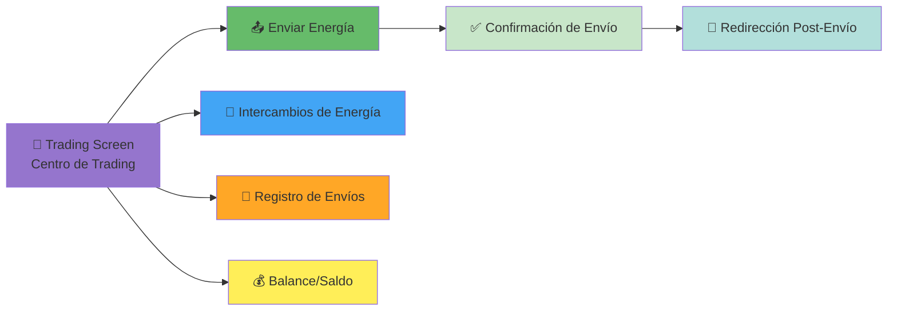

### 💱 Trading Screen - Características

**Archivo:** [lib/screens/main_screens/Trading/trading_screen.dart](../../lib/screens/main_screens/Trading/trading_screen.dart)

**Funcionalidades:**
- 💰 Visualización de balance/saldo
- ⚡ Interfaz de transferencia de energía
- 🎯 Speed dial para acciones rápidas

**Sub-pantallas de Trading:**

| Pantalla | Widget | Descripción |
|----------|--------|-------------|
| Enviar Energía | `EnviaEnergyScreen` | Formulario de envío de energía |
| Confirmación | `EnviarRedirectionScreen` | Redirección post-envío |
| Intercambios | `IntercambiosEnergyScreen` | Historial de intercambios |
| Registros | `EnviaRecordScreen` | Registros de transacciones |

---

## 👤 Sub-Navegaciones desde Mi Cuenta

### 6️⃣ Flujos desde Mi Cuenta (Perfil)

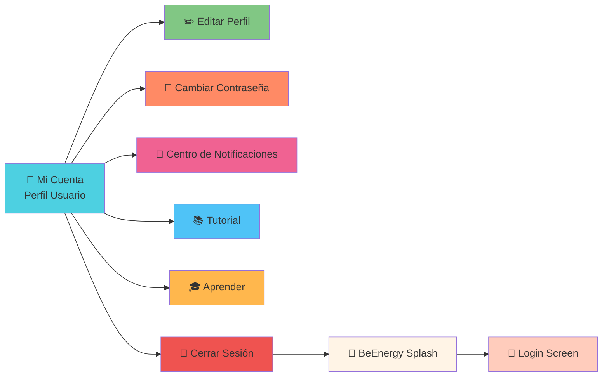

### 👤 Mi Cuenta Screen - Características

**Archivo:** [lib/screens/main_screens/miCuenta/miCuenta.dart](../../lib/screens/main_screens/miCuenta/miCuenta.dart)

**Opciones del Menú:**

| Opción | Pantalla | Widget | Descripción |
|--------|----------|--------|-------------|
| ✏️ Editar Perfil | Editar Perfil | `EditarPerfilScreen` | Modificar datos personales |
| 🔐 Cambiar Contraseña | Cambiar Clave | `CambiarClavePerfilScreen` | Actualizar contraseña |
| 🔔 Notificaciones | Centro de Notificaciones | `CentroNotificacionesPerfilScreen` | Configurar alertas |
| 📚 Tutorial | Tutorial | `TutorialScreen` | Guía de uso de la app |
| 🎓 Aprende | Aprender | `AprendeScreen` | Recursos educativos |
| 🚪 Cerrar Sesión | Logout | - | Cierra sesión y limpia stack |

### 🚪 Flujo de Cierre de Sesión

```dart
1. Usuario toca "Cerrar Sesión"
2. Alert Dialog de confirmación
3. Si confirma:
   a. DatabaseHelper.deleteUserLocal() → Elimina sesión local
   b. Navigator.pushAndRemoveUntil() → Limpia stack de navegación
   c. Redirige a Beenergy (entry point)
   d. Beenergy detecta sin usuario → Redirige a LoginScreen
```

---

## 👥 Gestión de Comunidad (7 Módulos)

### 7️⃣ Flujos de Gestión de Comunidad

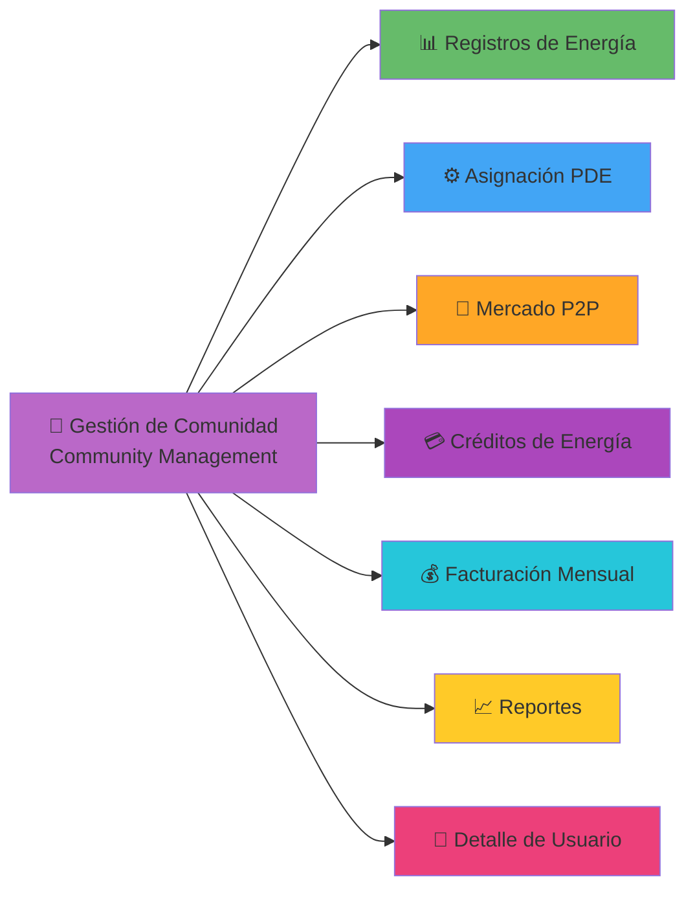

### 👥 Community Management Screen

**Archivo:** [lib/screens/main_screens/community/community_management_screen.dart](../../lib/screens/main_screens/community/community_management_screen.dart)

**Características:**
- 📋 Lista de miembros (15 miembros de UAO Community)
- 🔍 Filtro por rol (Prosumer/Consumer)
- 🔎 Funcionalidad de búsqueda
- 📊 Estadísticas de la comunidad
- 👤 Navegación a detalles de usuario

### 📊 Módulos de Gestión

| Módulo | Ruta | Widget | Descripción |
|--------|------|--------|-------------|
| 📊 Registros de Energía | `energyRecords` | `EnergyRecordsScreen` | Historial de producción/consumo |
| ⚙️ Asignación PDE | `pdeAllocation` | `PDEAllocationScreen` | Distribución de energía |
| 🤝 Mercado P2P | `p2pMarket` | `P2PMarketScreen` | Mercado entre pares |
| 💳 Créditos de Energía | `energyCredits` | `EnergyCreditsScreen` | Sistema de créditos |
| 💰 Facturación Mensual | `monthlyBilling` | `MonthlyBillingScreen` | Facturas mensuales |
| 📈 Reportes | `reports` | `ReportsScreen` | Reportes y análisis |

---

## 🛒 Flujos del Marketplace

### 8️⃣ Marketplace de Consumidor

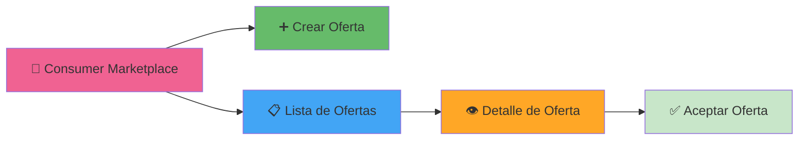

**Pantallas del Marketplace:**
- `ConsumerMarketplaceScreen` - Marketplace principal
- `ConsumerCreateOfferScreen` - Crear nueva oferta
- `ConsumerOffersListScreen` - Listado de ofertas
- `OfferDetailAcceptanceScreen` - Detalle y aceptación

### 📊 Bolsa/Exchange

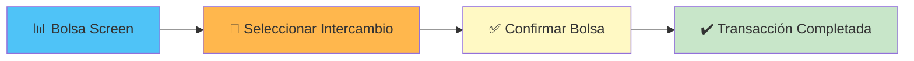

**Pantallas:**
- `BolsaScreen` - Marketplace/Exchange
- `ConfirmBolsaScreen` - Confirmación de intercambio

---

## 🔧 Pantallas Administrativas

### 9️⃣ Paneles de Administración

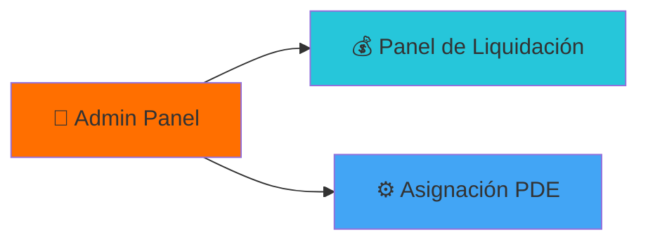

**Pantallas Admin:**
- `AdminLiquidationPanel` - Panel de liquidación
- `AdminPDEAssignmentScreen` - Asignación de PDE

### ⚡ Prosumer

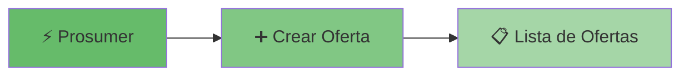

**Pantallas:**
- `ProsumerCreateOfferScreen` - Crear oferta como prosumidor

---

## 💳 Gestión de Pagos

### 🔟 Tarjetas y Pagos

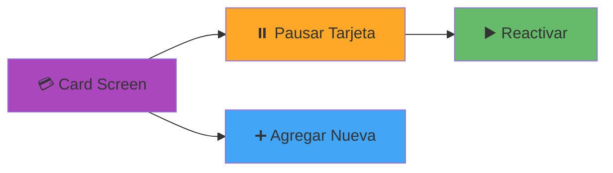

**Pantallas:**
- `CardScreen` - Gestión de tarjetas de pago
- `PauseCardScreen` - Pausar/activar tarjeta

---

## 📍 Otras Funcionalidades

### 1️⃣1️⃣ Pantallas Adicionales

| Pantalla | Widget | Descripción |
|----------|--------|-------------|
| 🗺️ Mapas | `MapasScreen` | Visualización de ubicaciones |
| 📄 Detalle de Transacción | `TransactionDetailScreen` | Detalles completos de transacción |
| 📜 Historial | `HistorialScreen` | Historial de transacciones |
| ⚙️ Configuración | `ConfiguracionScreen` | Configuración de la app |

---

## 📋 Tabla de Referencia Completa de Rutas

### 🔓 Rutas Públicas (No Requieren Autenticación)

| Ruta | Widget | Archivo | Descripción |
|------|--------|---------|-------------|
| `'beEnergy'` | `Beenergy()` | [main_screen.dart](../../lib/screens/main_screen.dart) | 💫 Pantalla de entrada/splash con verificación de auth |
| `'login'` | `LoginScreen()` | [login_screen.dart](../../lib/screens/main_screens/Login/login_screen.dart) | 🔑 Inicio de sesión |
| `'register'` | `RegisterScreen()` | [register_screen.dart](../../lib/screens/main_screens/Login/register_screen.dart) | 👤 Registro de nuevo usuario |
| `'RecuerdoMiClave'` | `NoRecuerdomiclaveScreen()` | [noRecuerdomiClave_screen.dart](../../lib/screens/main_screens/Login/noRecuerdomiClave_screen.dart) | 🔄 Recuperación de contraseña |

### 🔐 Rutas Protegidas - Navegación Principal

| Ruta | Widget | Archivo | Índice NavPages | Descripción |
|------|--------|---------|-----------------|-------------|
| `'home'` | `HomeScreen()` | [home_screen.dart](../../lib/screens/main_screens/home/home_screen.dart) | 0 | 🏡 Dashboard principal |
| `'energy'` | `EnergyScreen()` | [energy_screen.dart](../../lib/screens/main_screens/energy/energy_screen.dart) | 1 | ⚡ Monitoreo de energía |
| `'trading'` | `TradingScreen()` | [trading_screen.dart](../../lib/screens/main_screens/Trading/trading_screen.dart) | 2 (FAB) | 💱 Trading de energía |
| `'notificaciones'` | `NotificacionesScreen()` | - | 3 | 🔔 Notificaciones |
| `'historial'` | `HistorialScreen()` | - | - | 📜 Historial de transacciones |
| `'configuration'` | `ConfiguracionScreen()` | - | - | ⚙️ Configuración |

### 🔐 Rutas Protegidas - Gestión de Comunidad

| Ruta | Widget | Descripción |
|------|--------|-------------|
| `'communityManagement'` | `CommunityManagementScreen()` | 👥 Gestión de miembros de la comunidad |
| `'energyRecords'` | `EnergyRecordsScreen()` | 📊 Registros de energía |
| `'pdeAllocation'` | `PDEAllocationScreen()` | ⚙️ Asignación de PDE |
| `'p2pMarket'` | `P2PMarketScreen()` | 🤝 Mercado peer-to-peer |
| `'energyCredits'` | `EnergyCreditsScreen()` | 💳 Sistema de créditos energéticos |
| `'monthlyBilling'` | `MonthlyBillingScreen()` | 💰 Facturación mensual |
| `'reports'` | `ReportsScreen()` | 📈 Reportes y análisis |

---

## 🔐 Sistema de Autenticación

### 🛡️ Mecanismo de Protección de Rutas

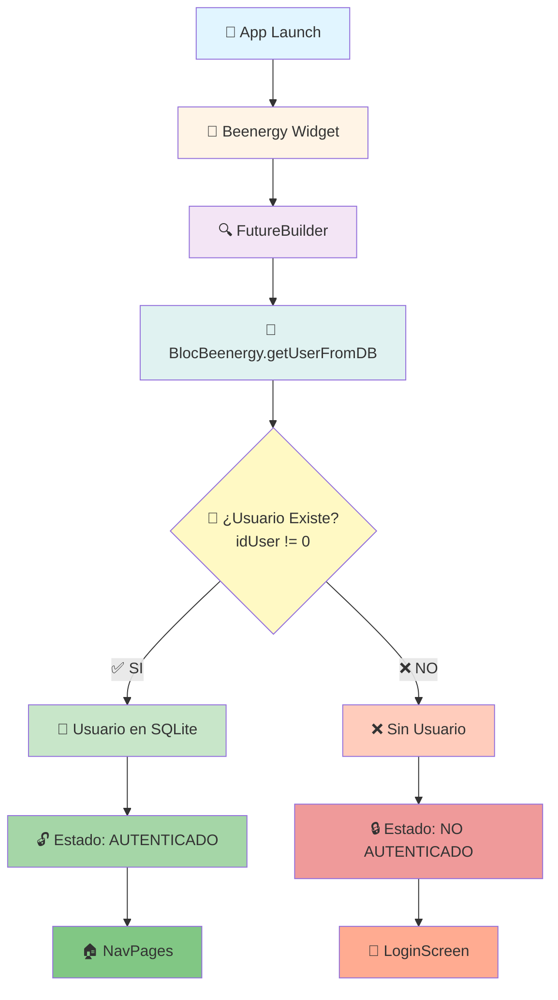

### 🗄️ Persistencia de Sesión

**Base de Datos:** SQLite (`beEnergy.db`)
**Helper:** [database_Helper.dart](../../lib/data/database_Helper.dart)

#### Tablas:
- **`UsuarioLogIn`** - Almacena usuario actualmente autenticado
- **`Usuarios`** - Almacena todos los usuarios registrados

#### Métodos Clave:
```dart
// Obtener usuario autenticado
getUser() → Usuario actual o null

// Agregar usuario en login
addUser(User user) → Guarda sesión

// Eliminar usuario en logout
deleteUserLocal() → Limpia sesión
```

### 🔑 Servicio de Autenticación

**Archivo:** [auth_service.dart](../../lib/core/services/auth_service.dart)
**Cliente API:** Singleton con Dio

#### Endpoints:
| Endpoint | Método | Descripción |
|----------|--------|-------------|
| `/auth/ping` | GET | Verificar conexión |
| `/auth/log-in` | POST | Inicio de sesión |
| `/auth/sign-up` | POST | Registro de usuario |
| `/auth/logout` | POST | Cerrar sesión |
| `/auth/verify-token` | POST | Validar JWT |
| `/auth/forgot-password` | POST | Recuperar contraseña |
| `/auth/reset-password` | POST | Restablecer contraseña |

### 🎫 Gestión de Tokens

**JWT Token:**
- Almacenado en `ApiClient` singleton
- Adjuntado automáticamente a todas las peticiones autenticadas
- Limpiado al cerrar sesión

**Flujo de Token:**
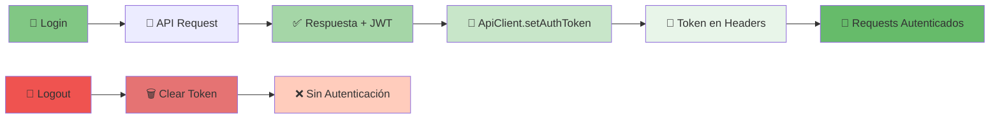

---

## 🧭 Patrones de Navegación

### 📍 Tipos de Navegación Utilizados

#### 1. Rutas Nombradas
```dart
Navigator.pushNamed(context, 'routeName');
```
**Ejemplo:**
```dart
Navigator.pushNamed(context, 'home');
Navigator.pushNamed(context, 'trading');
```

#### 2. Navegación Directa (MaterialPageRoute)
```dart
Navigator.push(
  context,
  MaterialPageRoute(builder: (_) => ScreenWidget())
);
```

#### 3. Extensiones de Context (Custom)
**Archivo:** [context_extensions.dart](../../lib/core/extensions/context_extensions.dart)

```dart
context.push(Widget)           // Push nueva pantalla
context.pop()                  // Regresar
context.pushReplacement()      // Reemplazar actual
context.pushAndRemoveUntil()   // Limpiar stack
```

#### 4. Limpiar Stack (Logout/Login)
```dart
Navigator.pushAndRemoveUntil(
  context,
  MaterialPageRoute(builder: (_) => Beenergy()),
  (route) => false  // Elimina todas las rutas previas
);
```

**Uso:** Cerrar sesión, Login exitoso

---

## 📂 Archivos Clave de Navegación

### 🗃️ Estructura de Archivos

| Archivo | Ruta | Responsabilidad |
|---------|------|-----------------|
| **main.dart** | [lib/main.dart](../../lib/main.dart) | ⚙️ Configuración de app + Definición de rutas |
| **routes.dart** | [lib/routes.dart](../../lib/routes.dart) | 📦 Hub de exportación de pantallas |
| **main_screen.dart** | [lib/screens/main_screen.dart](../../lib/screens/main_screen.dart) | 💫 Punto de entrada (BeEnergy) |
| **navigation.dart** | [lib/views/navigation.dart](../../lib/views/navigation.dart) | 📱 Bottom Navigation (NavPages) |
| **context_extensions.dart** | [lib/core/extensions/context_extensions.dart](../../lib/core/extensions/context_extensions.dart) | 🔧 Helpers de navegación |
| **auth_service.dart** | [lib/core/services/auth_service.dart](../../lib/core/services/auth_service.dart) | 🔐 Servicio de autenticación |
| **database_Helper.dart** | [lib/data/database_Helper.dart](../../lib/data/database_Helper.dart) | 💾 Persistencia de sesión SQLite |

---

## 📊 Resumen de Navegación

### 📈 Estadísticas del Proyecto

- **Total de Rutas Nombradas:** 20+
- **Rutas Públicas:** 4
- **Rutas Protegidas Principales:** 6
- **Rutas de Gestión de Comunidad:** 7
- **Pantallas en Bottom Navigation:** 5 (4 visibles + 1 FAB)
- **Niveles de Navegación:** 3 niveles (Principal → Sub-pantallas → Detalles)

### 🎯 Flujo Completo Resumido

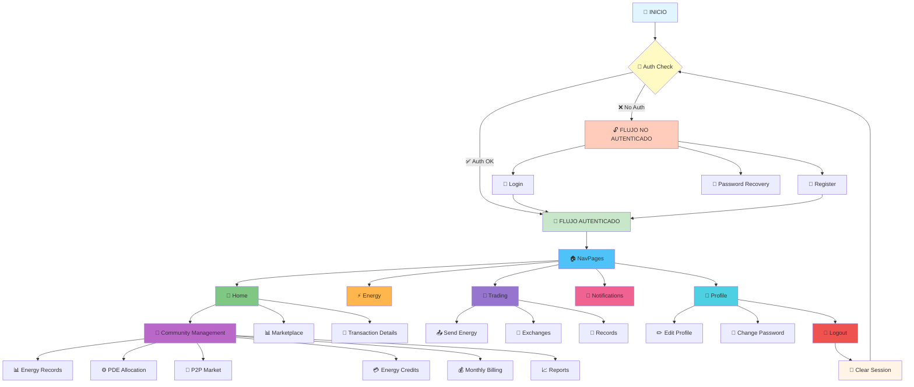

---

## 🔍 Leyenda de Símbolos

| Símbolo | Significado |
|---------|-------------|
| 🔓 | Ruta Pública (No requiere autenticación) |
| 🔐 | Ruta Protegida (Requiere autenticación) |
| 🏠 | Bottom Navigation (Navegación principal) |
| 💫 | Punto de entrada / Splash |
| ⚡ | Acción rápida / FAB |
| 🚪 | Cerrar sesión / Logout |
| 📊 | Datos / Reportes |
| 👥 | Gestión de usuarios / Comunidad |
| 💱 | Trading / Intercambio |
| 🔔 | Notificaciones |
| ⚙️ | Configuración / Settings |

---

## 📝 Notas Importantes

### ⚠️ Puntos Clave

1. **Verificación de Autenticación:**
   - Se realiza UNA SOLA VEZ en el punto de entrada (`Beenergy`)
   - NO hay guards de ruta explícitos en navegaciones internas
   - La sesión persiste mientras el usuario no cierre sesión

2. **Persistencia de Estado:**
   - `PageStorage` mantiene posiciones de scroll en Bottom Navigation
   - SQLite mantiene sesión entre cierres de app
   - JWT token se mantiene en memoria durante la sesión

3. **Cierre de Sesión:**
   - Limpia base de datos local
   - Limpia stack de navegación completo
   - Redirige a punto de entrada (BeEnergy)
   - Usuario debe volver a autenticarse

4. **Bottom Navigation:**
   - NO recrea widgets al cambiar de tab
   - Preserva estado de cada pantalla
   - FAB central para acción principal (Trading)

5. **Navegación Jerárquica:**
   - Nivel 1: Bottom Navigation (5 pantallas principales)
   - Nivel 2: Sub-pantallas accesibles desde principales
   - Nivel 3: Pantallas de detalle o formularios

---

## 🚀 Inicio Rápido

### Para Usuarios No Autenticados:
```
1. Abrir App → BeEnergy Splash
2. No hay usuario → LoginScreen
3. Opciones:
   - Login con credenciales existentes → NavPages
   - Registrarse → RegisterScreen → NavPages
   - Recuperar contraseña → NoRecuerdomiclaveScreen
```

### Para Usuarios Autenticados:
```
1. Abrir App → BeEnergy Splash
2. Usuario encontrado en SQLite → NavPages (Bottom Nav)
3. Navegar entre 5 pantallas principales con Bottom Navigation
4. Acceder a sub-funcionalidades desde cada pantalla
5. Cerrar sesión desde Perfil → Volver a LoginScreen
```

---

## 📅 Última Actualización

**Fecha:** 2025
**Versión de la App:** Según package.json
**Documentado por:** Claude Code - Anthropic
**Basado en:** Análisis del código fuente de BeEnergy Flutter App

---

## 📞 Referencias

- **Repositorio:** `d:\Repositorios\Autonoma\BeEnergy`
- **Plataforma:** Flutter (Android/iOS)
- **Arquitectura:** Clean Architecture con BLoC pattern
- **Base de Datos:** SQLite
- **API:** RESTful con autenticación JWT

---

*Este documento mapea toda la estructura de navegación de BeEnergy. Para detalles de implementación específica de cada pantalla, consultar los archivos fuente referenciados.*
